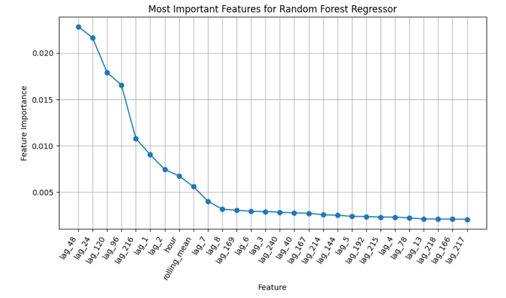
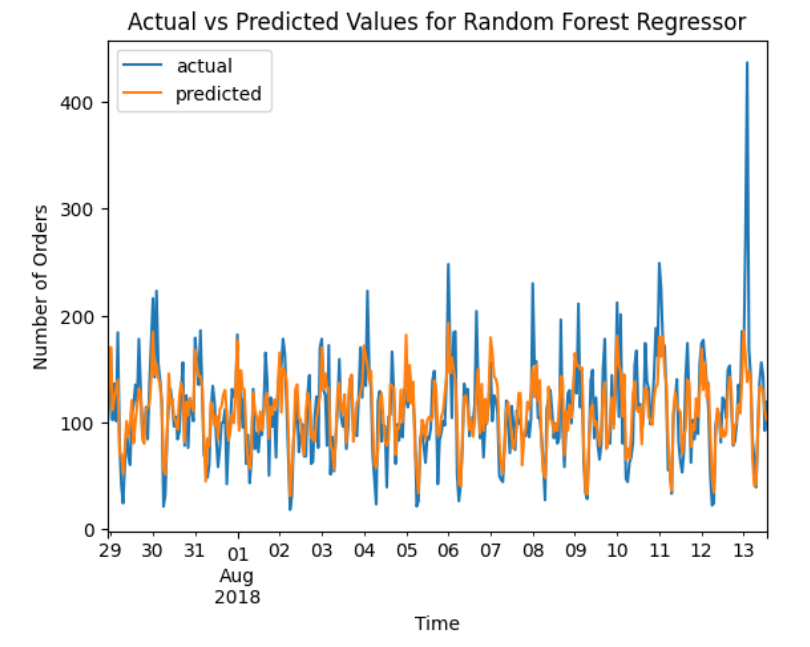

# Sprint 13 Project: Time Series
 
---

### 📚 Table of Contents
- 🔍 [Project Overview](#project-overview)
- 📈 [Conclusion](#conclusion)
- 🖼️ [Sample Outputs](#sample-outputs)
- 📁 [Files](#files)

---

## Project Overview

Sweet Lift Taxi company has collected historical data on taxi orders at airports. To attract more drivers during peak hours, we need to predict the amount of taxi orders for the next hour. Build a model for such a prediction.

The RMSE metric on the test set should not be more than 48.

---

## Conclusion

The purpose of this project was to forecast the number of hourly taxi orders based on historical data from the Sweet Lift Taxi company. The data were appropriate to the project after resampling to one-hour intervals. They showed an increasing trend, a seasonal component at the scale of one day, and autocorrelations spiking at intervals of 24 hours. The time series was also stationary (p < 0.05).

I trained and tuned a linear regression model on features created from the time series, including calendar features, lag features, and rolling mean. After testing several specifications, I retained only the most important features as measured by coefficient size. They included month, day of week, day, hour, and various lags. The final linear regression model performed well with an RMSE of 29.01.

Next, I trained and tuned a random forest regressor model on features created from the time series using the same procedure as before. The most important features included hour, rolling mean (with a 24-step window), and various lags. I also optimized hyperparameters, finding a reasonable balance of performance and complexity with 50 estimators, max_depth of 10, and an RMSE of 29.74.

Finally, I trained and tuned an ARIMA model. I kept the hyperparameter search simple to avoid problems with the kernel crashing and assumed seasonality with a period of one day. The best scoring model had hyperparameters p = 2, d = 1, q = 1, P = 1, D = 0, Q = 0, and an RMSE of 46.89. A plot of predicted vs. actual values showed that the model failed to account for seasonality beyond the first few days, quickly collapsing to a constant model. That explains why it scored so much worse than the other models. Unfortunately, I could not get models with stronger seasonality to run without crashing.

All three optimized models were trained and tested on the full training and testing data sets. The test performance was disappointing, though the linear regression (RMSE = 36.10) and random forest regressor (RMSE = 41.52) models performed much better than the ARIMA model (RMSE = 63.27). I suspect the more robust lag terms included in the linear regression model (ranging from two hours to nine days) captured the seasonal component of the data better than the relatively simple ARIMA model. The weak test performance for all models stems from the last month of the time series (comprising the test set) departing noticeably from earlier data by exhibiting a greater mean and dispersion. Without more data, I cannot tell whether that difference represented an aberration or a fundamental shift in taxi demand. More research will be needed to address that.

In the end, the linear regression model was the best, outperforming the others and easily beating the project threshold RMSE score of 48. It should serve the Sweet Lift Taxi company well for predicting hourly taxi demand at airports.

---

## Sample Outputs

Here are two key moments from the analysis:

  
*Feature importances from the random forest model show lag values and hour of day as the most informative predictors of demand.*

 

  
*Model predictions closely track actual taxi demand over time, capturing key peaks and dips with minimal error.*

---

## Files

📄 See the full analysis in [`sprint-13-project.ipynb`](./sprint-13-project.ipynb)  
📄 Or view a static version in [`sprint-13-project.html`](./sprint-13-project.html)  
📄 Project background: [`project-description.md`](./project-description.md)

> Note: This project uses one CSV file, which is included in the `/data/` folder.  
> See [`/data/README.md`](./data/README.md) for details.
